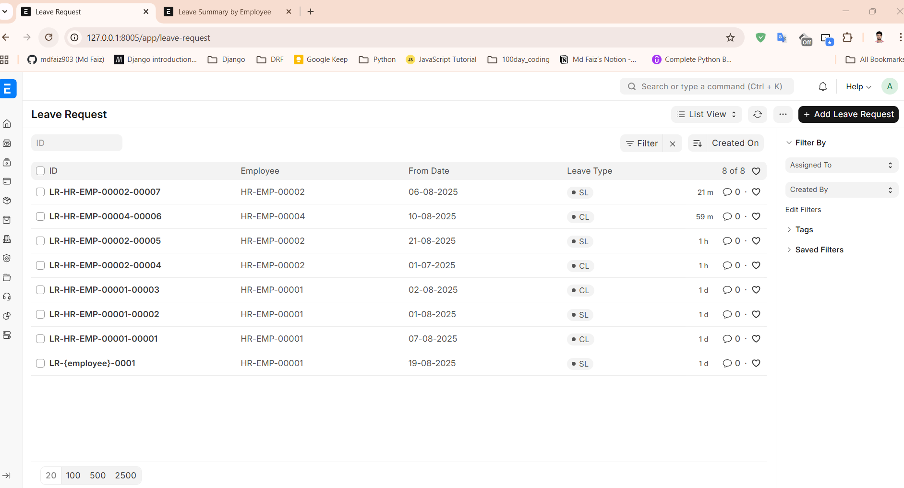
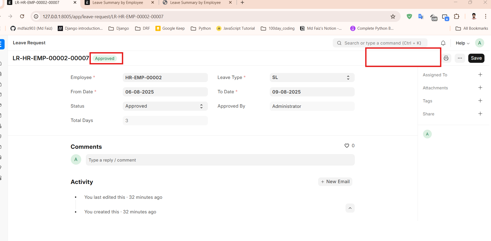
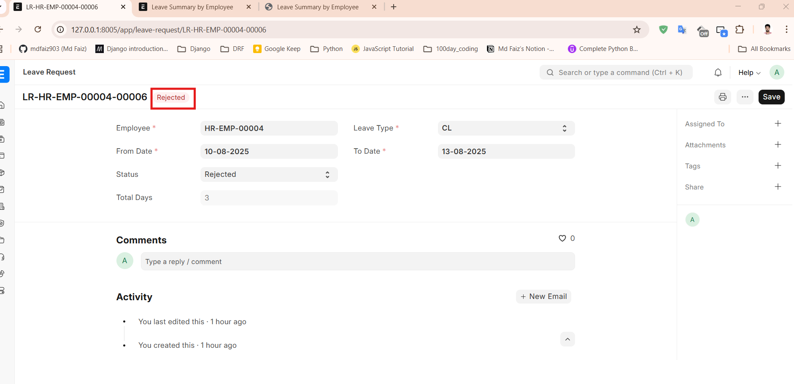
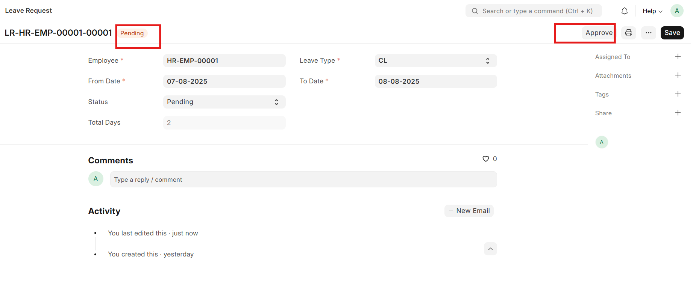
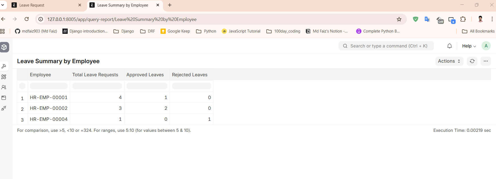
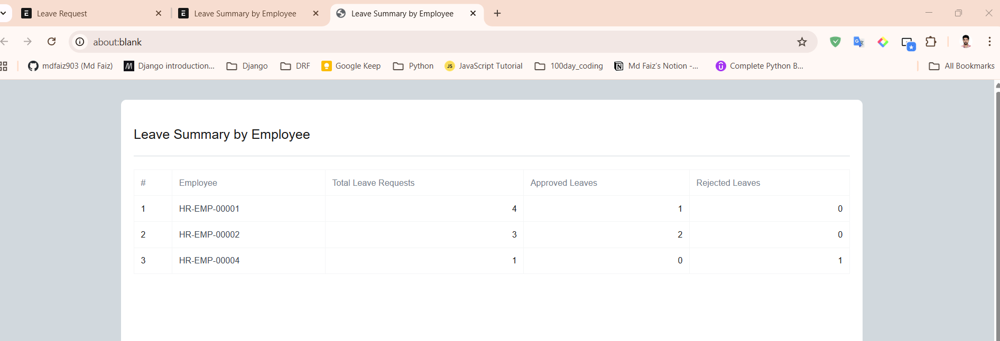

# HR Leave & Attendance Module

A simple **custom Frappe app** for managing Leave Requests and Attendance approvals.  
Built with **Frappe Framework v16 (dev)**.  

Repository: [invento_leave_attendance](https://github.com/mdfaiz903/invento_leave_attendance)  
(Current branch: `develop`)
(Production branch: `main`)

---

## 🛠️ Installation

### 1. Setup Frappe Bench (v16 dev)
```bash
# Install bench if not already installed
pip install frappe-bench

# Init bench with frappe v16
bench init frappe-bench --frappe-branch version-16
cd frappe-bench

# Create site
bench new-site site_name
2. Get the App
cd apps
git clone https://github.com/mdfaiz903/invento_leave_attendance.git
cd ..
3. Install on Site
bench --site site_name install-app invento_leave_attendance
bench start


# Features & Functionality
📌 Leave Request Doctype
Employee (linked to ERPNext Employee Doc)

From Date / To Date validation

Leave Type (CL, SL, EL)

Status workflow: Pending → Approved / Rejected

Approved By (auto-filled when approved)

Total Days (auto-calculated excluding weekends)

📌 Server-side validations
From Date must be before To Date

Maximum leave duration: 5 days

📌 Client-side logic
Auto-calculate Total Days excluding Saturday & Sunday

Show info message when Leave Type = EL

Custom Approve button

Visible only to HR Manager when status = Pending

Sets Status = Approved and Approved By = current user

📌 Script Report: Leave Summary by Employee
Employee

Total Leave Requests

Approved Leaves

Rejected Leaves

Grouped by Employee

📷 Screenshots
Leave Request Doc


Approved


Rejected


Pending


Earned Leave Message


Leave Summary Report


Print View of Report



